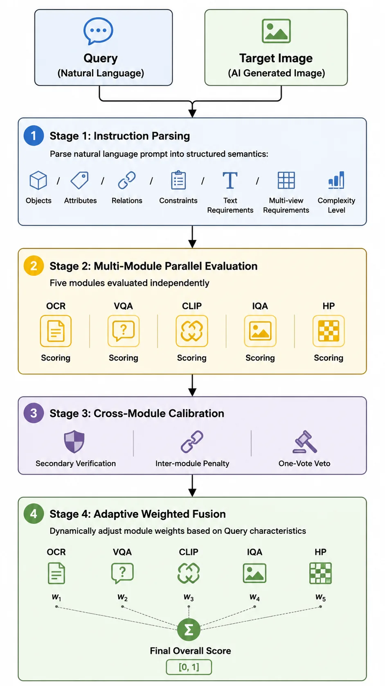

It's been a while since ERNIE-Image launched, and we've received overwhelmingly positive feedback. **Thank you so much for your love and support for the model.**

Today I want to talk about how I designed a fully automated evaluation system with LLM-as-a-Judge at its core — one that **breaks through the limitations of single-metric benchmarks** and **captures the true capability boundaries of modern T2I models**. By identifying model weaknesses through evaluation, we've been able to steer ERNIE-Image's iterations in the right direction, making it lean and powerful.

## 1. Why Build Our Own Evaluation Set

Since the release of Gemini 3 Pro, the image generation field has undergone a generational leap. Advanced models can now handle **precise text rendering**, **world-knowledge-based reasoning generation**, and **complex instruction following** — yet mainstream benchmarks like GenEval, T2I-CompBench, and DrawBench were never designed to evaluate these capabilities.

I conducted a systematic review of mainstream T2I evaluation benchmarks and found that while each has its strengths, they all have significant blind spots:

|**Evaluation Capability**|**GenEval**|**T2I-CompBench++**|**DrawBench**|**PartiPrompts**|**DPG-Bench**|**TIFA**|**HPS v2**|**ImageReward**|**FID**|**Ours**|
|-|-|-|-|-|-|-|-|-|-|-|
|Object Composition|✓|✓|✓|✓|✓|✓|✗|✗|✗|✓|
|Attribute Binding|✓|✓|✓|✓|✓|✓|✗|✗|✗|✓|
|Spatial Relations|✓|✓|✓|✓|✓|✓|✗|✗|✗|✓|
|Counting|✓|✓|✓|✓|✓|✓|✗|✗|✗|✓|
|Text Rendering Accuracy|✗|✗|Partial|Partial|✗|Partial|✗|✗|✗|✓|
|World Knowledge Correctness|✗|✗|✗|Partial|✗|✗|✗|✗|✗|✓|
|Multi-view Consistency|✗|✗|✗|✗|✗|✗|✗|✗|✗|✓|
|Image Quality / Aesthetics|✗|✗|✓|Partial|✗|✗|✓|✓|✓|✓|
|Human Preference Alignment|✗|✗|✓|✓|✗|✗|✓|✓|✗|✓|
|Complex / Long Prompts|✗|✗|✗|✓|✓|✗|✗|✗|✗|✓|
|Cross-module Calibration|✗|✗|✗|✗|✗|✗|✗|✗|✗|✓|
|Dynamic Scoring Weights|✗|✗|✗|✗|✗|✗|✗|✗|✗|✓|
|Fully Automated|✓|✓|✗|✗|✓|✓|✓|✓|✓|✓|

**Core characteristics and limitations of each benchmark:**

* **GenEval** — Verifies compositional generation via object detection; highly automated, but only covers structural attributes without aesthetics or style.
* **T2I-CompBench++** — Fine-grained compositional faithfulness (attribute binding, spatial relations, counting) using specialized metrics like BLIP-VQA, but lacks image quality dimensions.
* **DrawBench** — 200 challenging prompts from Google across broad categories, but relies on human scoring — expensive and hard to reproduce.
* **PartiPrompts** — 1,600+ prompts graded by difficulty, covering world knowledge and creative compositions, but also requires human evaluation.
* **DPG-Bench** — Specializes in faithfulness for long/dense descriptions, using VQA decomposition to verify prompts atom by atom.
* **TIFA** — Converts prompts into atomic VQA questions for item-by-item checking, similar in spirit to our VQA module, but lacks quality/aesthetics dimensions.
* **HPS v2 / ImageReward** — Human preference prediction models that output a single scalar score, unable to diagnose specific failure causes.
* **FID** — Measures distribution-level quality of generated image sets; completely ignores text-image alignment and requires large-scale sampling.

When a user's prompt asks the model to **"generate a Chinese infographic about the steps of making cardamom tea," none of the above benchmarks can comprehensively measure**: whether the rendered text is correct, whether the factual content is accurate, whether the layout design meets standards, whether there's a heavy AI-generated feel, and whether the image is ultimately "usable" — yet these are precisely **the issues users perceive most readily in actual use**.

My goal is to build an evaluation framework that can answer one question: **"Does this model actually work, or not?"**

## 2. How the Evaluation Set Was Built

The evaluation set is the foundation of the entire system — prompt design directly determines what you can and cannot test.

I built a **comprehensive hierarchical taxonomy** based on real-world T2I use cases:

```text
Taxonomy Example:
L1 (Object Type)              L2 (Category)          L3 (Subcategory)
───────────────              ──────────           ─────────────
Text-rich Images............ Infographics         Science posters, journals, flowcharts
                             Data Visualization    Charts, knowledge graphs
                             UI/Slides            Interfaces, presentations

Graphic Design............. Logo/Icons            Stickers, collages, emojis

Objects.................... Daily/Electronics     Food, clothing, furniture

Product Design............. Packaging/Industrial  Die-cuts, three-views, architecture

Scenes.................... Indoor/Urban/Nature    Cross-sections, isometric views

Portraits................. Professional/Fashion   Groups, age/ethnicity diversity

Style Diversity........... Traditional Media      Watercolor/ink/oil/sketch...
                           Photography Effects    Film/macro/bokeh...
                           3D/VFX               Clay/low-poly/particles...
                           Art Movements         Anime/pixel/cyberpunk...
```

The taxonomy is just the skeleton — what matters more is how the prompts are written. Here are a few design tricks:

### (a) Every prompt is tagged with its "core test point"

We don't just throw in prompts randomly. Each prompt is explicitly tagged at ingestion with what it's actually testing — text rendering precision, spatial relationship understanding, or world knowledge. This way, when a model fails on a specific prompt, we can immediately pinpoint the exact capability gap rather than vaguely saying "this one didn't pass."

### (b) Deliberately designed "mixed-requirement" prompts

Real user prompts often span multiple dimensions simultaneously — "Draw a girl wearing Zhuang ethnic costume, front and back three-view, with clothing names labeled beside." This single prompt tests: world knowledge (what Zhuang costume looks like), multi-view (front and back), text rendering (labels), and instruction following (overall composition). These cross-cutting prompts are the sharpest tools for catching model "blind spots."

### (c) "Negative prompts" are essential

Beyond testing what models can do, we also test whether they can correctly handle negation — "Draw a minimalist logo without any text," "Generate a portrait without glasses." Many models still struggle with "don't include X," and these prompts effectively expose deep instruction-following deficiencies.

### (d) Extra emphasis on text rendering

English text rendering is already decent for many models, but languages like Chinese — with complex strokes and many visually similar characters — have significantly higher error rates. So we deliberately overweight Chinese text prompts and specifically designed test cases with easily confused characters, rare characters, and vertical layouts.

## 3. Evaluation System Architecture

### Five-Dimension Evaluation Taxonomy

We propose a **five-dimension evaluation taxonomy**, where each dimension corresponds to a typical failure mode:

* **OCR (Text Rendering)** — Can the model accurately render specified text? Character-level precision verification.
* **VQA (Instruction Following)** — Does the generated image satisfy every requirement in the prompt? Fine-grained item-by-item checking.
* **CLIP (Semantic Alignment)** — Does the image's overall semantics align with the prompt? Three-level matching: objects / attributes / relations.
* **IQA (Image Quality)** — Is the image technically excellent? Clarity, composition, color, and detail refinement.
* **HP (Human Preference)** — Would humans prefer this image? Multi-subdimension scoring across spatial structure, physical plausibility, aesthetics, style, creativity.

### Overall Pipeline

The system follows a **"Parse → Evaluate → Calibrate → Fuse"** four-stage paradigm:

<style>
.article-body img[alt="Evaluation system pipeline"] {
  max-width: min(100%, 520px);
}
</style>



Key design principle: Modules don't score in isolation and simply average — instead, **Stage 3's cross-module calibration** enables collaboration. **A critical failure in one dimension propagates to other modules**, **preventing the "fail one subject but pass overall" paradox**.

## 4. Key Technical Design Decisions

Building the evaluation system involved plenty of trial and error, but also yielded some effective designs. Here are the ones I find most valuable.

### (1) Text Evaluation Can't Be a One-Pass Job — OCR Secondary Verification

After running evaluations for a while, I noticed a pattern: LLM-as-a-Judge is **remarkably lenient on text errors** during holistic evaluation. When the overall image looks good, the evaluator tends to turn a blind eye to text mistakes — I call this **"leniency bias."**

So I added an **independent secondary verification**: after the main evaluation completes, a separate strict character-by-character comparison is performed. The final score takes the stricter (lower) of the two.

More critically, there's **cross-module linkage** — when text content is severely wrong, it's not just the OCR score that drops; the VQA instruction-following score gets pulled down too. Incorrect text is fundamentally a failure to follow instructions — **other dimensions' high scores shouldn't mask this core deficiency**.

### (2) Multi-view: "Having Views" Isn't Enough — They Must Be Correct and Consistent

Users increasingly use T2I for character design — "Draw my character's front, side, and back three-view." Existing benchmarks have zero coverage for this.

I broke the evaluation into three axes:

|**Axis**|**What It Checks**|
|-|-|
|View Completeness|Are all requested viewpoints present? Are they spatially separated independent regions?|
|Viewpoint Correctness|Is the one labeled "back view" actually showing the back?|
|Cross-view Consistency|Do the front and back match in clothing, color scheme, and proportions?|

Similarly, severe multi-view deficiency triggers **linkage penalties** — a model that only drew the front view can't ride other dimensions to a high score.

### (3) World Knowledge: No Matter How Beautiful, Wrong Is Wrong

This is the most interesting dimension in my opinion. Existing benchmarks only evaluate "common sense" — humans shouldn't have six fingers, objects shouldn't float. But **domain-specific factual knowledge** goes completely unchecked.

Example: the prompt asks for Zhuang ethnic costume, but the model generates Miao ethnic patterns — beautiful composition, perfect layout, CLIP score 0.9 — **but it's simply wrong**.

I added a standalone "world knowledge correctness" dimension covering **six domains: historical culture, geographic landmarks, brand IP, biological morphology, scientific facts, and cultural identity**. It's designed as a **veto mechanism**: if this dimension fails, the overall result is immediately "unacceptable" regardless of other scores.

**If the world knowledge isn't even correct, how can users use it?**

### (4) Dynamic Weights: Different Prompts Have Completely Different Priorities

This one's intuitive:

* "Generate a greeting card with 'Happy New Year'" → Text correctness is the lifeline
* "Generate a landscape painting" → No text at all; OCR shouldn't participate in scoring
* "Generate character three-view" → Multi-view consistency is the core

So I implemented **dynamic weight switching**: the instruction parsing stage automatically extracts query features. When text requirements are detected, OCR weight increases significantly; when absent, OCR exits entirely and remaining module weights normalize. Weights always sum to 1, ensuring cross-type score comparability.

Additionally, instruction parsing outputs a **complexity level** — higher complexity means more and finer VQA checklist items downstream. A simple prompt might need only 5 verification points, while a high-complexity infographic prompt gets decomposed into 20+ atomic checks. Evaluation granularity adapts to prompt complexity: simple prompts aren't over-examined, complex ones don't miss details.

### (5) Fighting Score Inflation

LLM-as-a-Judge has a well-known problem: **it's too generous with scores**. Most images get a 70-80 from it.

My countermeasures:

* **Distribution anchoring**: The evaluation prompt explicitly states "most images should fall in the middle range; scores above 0.9 should be extremely rare"
* **Deduction mindset**: Force starting from a perfect score and deducting point by point, rather than building up from zero
* **Cross-validation**: The same capability is examined from different angles by multiple modules; a single module's inflated score gets pulled back by the others

### (6) Every Module Scores More Than One Number — Decompose Until You Can Diagnose

An evaluation system shouldn't just tell you "this image is 60 points" — it should tell you "exactly where it falls short." So every module is internally decomposed:

**VQA goes through a checklist item by item.** It transforms "is this image good?" into a series of atomic yes/no questions — for the prompt "red sports car parked on a seaside cliff, lighthouse in the distance," it decomposes into: Does a car exist? Is it red? Is there a cliff? Is there a lighthouse? Is the car parked (not floating)? Each item is independently judged, and the report precisely shows "missing lighthouse, car color skews orange."

**CLIP is split into three alignment levels.** Traditional CLIP only computes one coarse similarity score. I refined it into object-level (are all things present?), attribute-level (are colors and materials correct?), and relation-level (are positions and interactions right?). An image might score perfectly on objects but fail completely on colors — this kind of localization is invaluable for guiding model improvements.

**IQA added a "magnifying glass" dimension.** Traditional image quality assessment looks at overall appearance, but AI-generated images have a classic problem: thumbnails look fine, but zoom in and everything's blurry. So I added **detail refinement** — specifically evaluating hair textures, material quality, and edge sharpness, helping us catch mountains of "A-grade from afar, C-grade up close" images.

**HP is split into six independent sub-dimensions.** When people feel "this image isn't right," the underlying reasons can be completely different: messy composition (spatial structure), physical implausibility (person floating), ugly colors (aesthetics), or style mismatch. Scoring these independently is the only way to pinpoint which link is dragging things down, rather than vaguely saying "humans don't like it."

## 5. Lessons Learned

After several iterations, here are a few hard-won insights:

1. **Cross-module penalties are non-negotiable.** Without them, images with completely wrong text can still pass on other dimensions. But users seeing such images will always say "this doesn't work." **The evaluation system must align with user intuition.**
2. **Score inflation is a long war.** LLM judges naturally skew high, and they drift over time. **Distribution anchoring and periodic calibration against human annotations cannot be skipped.**
3. **Dynamic weights deliver immediate results.** Fixed weights systematically overestimate text-heavy prompt scores and underestimate pure-visual prompt scores. **Letting the evaluation system decide "what matters most for this prompt" is far more reliable than humans setting weights by gut feel.**
4. **World knowledge is the safety net.** CLIP says 0.9, but Zhuang costume was drawn as Miao — users spot this instantly, yet without this dimension the evaluation system can't detect it at all. **Some errors aren't "not good enough" — they're "fundamentally wrong," and there must be a dimension that dares to veto.**

## Final Thoughts

T2I models have evolved from "can it draw a cat?" to "can it draw an accurate, aesthetically pleasing, knowledge-correct multilingual infographic?" Evaluation methods must keep pace.

The core value of this framework: comprehensive coverage, robust calibration, adaptive scoring, and interpretable diagnostics. It helps us continuously discover model weaknesses and drives ERNIE-Image to improve version by version.

I hope these ideas are useful to others working on similar problems.

---

Xiaowen Yang,

Strategy Product Manager for ERNIE-Image, Evaluation & Data Team, Baidu.

May 21, 2026, Beijing.
